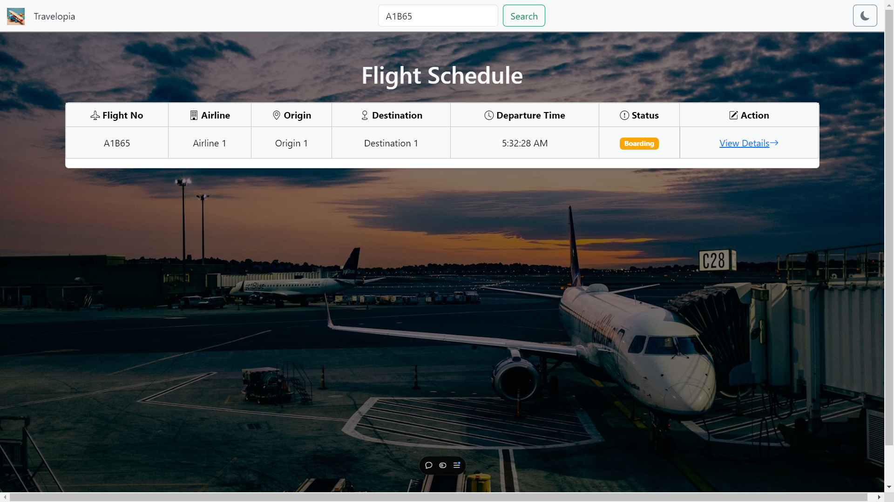
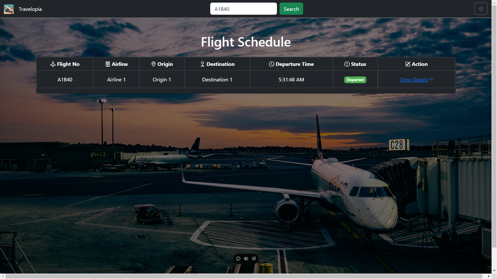
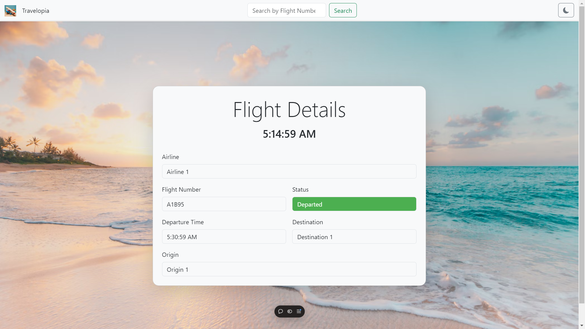
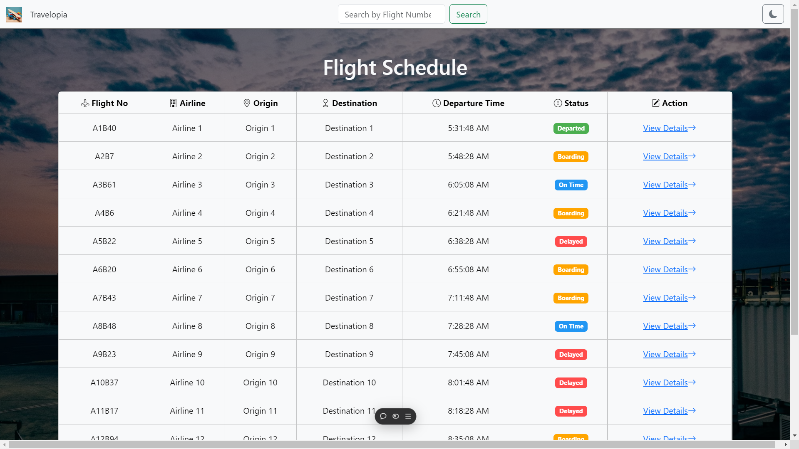

# Flight Status Board Application

## Overview

The Flight Status Board Application is a React-based web application that retrieves and displays flight information, including flight details, statuses, and schedules. Users can search for flights by flight number and toggle between light and dark themes can also get details of particular flight.

## Features

- **Fetch Flight Data**: Retrieve flight information from a mock API.
- **Flight Details**: View detailed information for each flight.
- **Search Functionality**: Search flights by their flight numbers.
- **Responsive Design**: The application is designed to work on various screen sizes.
- **Theme Toggle**: Switch between light and dark themes.
- **Real-time Clock**: Displays the current time and updates every second.

- 
## Screenshots

Here are some screenshots of the application:

### Flight Schedule


### Flight Details


### Flight Details


### Flight Details


### Flight Details


### Flight Details


## Technologies Used

- **Frontend**:

  - React
  - TypeScript
  - Bootstrap for styling
  - Axios for API requests

- **Testing**:
  - Jest for unit testing

## Installation

1. Clone the repository:

   ```
   git clone https://github.com/sislam824/travelopia.git
   cd flight-status-board

   ```
<<<<<<< HEAD
=======
   
2.Install dependencies: 

   ```
   npm install
   
   ```

3. Start the application:

   ```
   npm run dev
   
   ```
   
4. Open your browser and navigate to
   
   ```
   npm run dev
   
   ```
6. Unit test
   ```
   npm test
   
   ```
>>>>>>> facc6eeae442c14100dc7fa1751c6b203c56c27e
